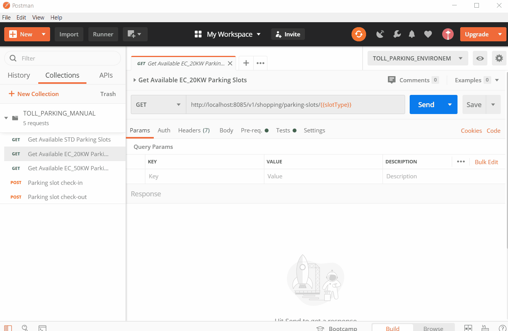

# Toll Parking

[](https://travis-ci.com/Anasss/tollParking)
[](https://www.codacy.com/manual/Anasss/tollParking?utm_source=github.com&amp;utm_medium=referral&amp;utm_content=Anasss/tollParking&amp;utm_campaign=Badge_Grade)
[](https://codecov.io/gh/Anasss/tollParking)

Toll Parking is a simple [Spring Boot](https://spring.io/projects/spring-boot) REST API Application, It manages the toll parking of standard and electric cars.

## Tech stack:

* [Spring Boot](https://spring.io/projects/spring-boot)
* [Jpa](https://docs.spring.io/spring-data/jpa/docs/current/reference/html/#reference)
* [h2 Database](https://www.h2database.com/html/main.html)
* [JUnit 5](https://junit.org/junit5/)
* [Jacoco](https://www.jacoco.org/jacoco/)
* [Postman](https://www.postman.com/)
* [Swagger2](https://swagger.io/)
* [Travis CI](https://travis-ci.com/)
* [Codacy](https://www.codacy.com/)
* [Synk](https://snyk.io/)

## Prerequisistes:

* JDK 8: You can use [Oracle JDK8](https://www.oracle.com/java/technologies/javase/javase-jdk8-downloads.html) or [Open JDK](https://openjdk.java.net/install/)
* Maven 3.5.X: For dependencies management [Download Maven](https://maven.apache.org/download.cgi)
* H2: In memory Database [Download H2 DB](https://www.h2database.com/html/download.html)
* Postman: For testing Toll Parking API [Download Postman](https://www.postman.com/downloads/)

## How to build and run from sources?

* Clone the repository:

```
git clone https://github.com/Anasss/tollParking.git 

```

* Install dependencies:

```
cd tollParking
mvn install

```

* Running the app:

```
mvn spring-boot:run

```

**N.B:** 
* The Installation and the running of the app could be also done using an IDE like [IntelliJ](https://www.jetbrains.com/fr-fr/idea/) or [Eclipse](https://www.eclipse.org/downloads/)
* By default, the app is running on port 8085, this could be changed by editing the file [application.properties](https://github.com/Anasss/tollParking/blob/master/src/main/resources/application.properties)

## Postman Collection:

A postman collection was attached to the repository under the postman folder. It contains the API entry-points and perform some basic tests on the flow.

In order to import it, open Postman and import Collection and Environement json files:

```
File -> Import -> Drop the collection json file: TOLL_PARKING_MANUAL.json
File -> Import -> Drop the Environement json file: TOLL_PARKING_ENVIRONEMENT.json

```
You can now run nominal scenarios without editing any request with the predefined PM parameters (Check-in first parkingSlot found!)

### Demo:



## Documentation: :memo:

### Swagger:
Swagger is used to describe and document Toll Parking REST API.

Once the application is running, Swagger documentation could be accessed from: http://localhost:8085/swagger-ui.html

### Overview:

#### Requirement:

A toll parking contains multiple parking slots of different types (Standard and Electrical).

Cars of all types come in and out randomly, the API must :
- Send them to the right parking slot of refuse them if there is no slot (of the right type) left.
- Mark the parking slot as Free when the car leaves it
- Bill the customer when the car leaves.

#### API Entry-points: :round_pushpin:

<ul>
<li><i>GET</i> Available parking slots: <i>/v1/shopping/parking-slots/{slotType}</i> Where slotType :</br>
		<ul>
		   <li><b>STD </b> For standard cars: gasoline-powered</li>
		   <li><b>EC_20KW</b> For 20kw power supply for electric cars</li>
		   <li><b>EC_50KW</b> For 50kw power supply for electric cars</li>
		</ul>
</li>
<li><i>POST</i> Check-in a parking slot: <i>/v1/check-in/parking-slot/{slotId}/{slotType}</i> </li>
<li><i>POST</i> Check-out a parking slot and issue the bill: <i>/v1/check-out/parking-slot/{vehicleId}</i> </li>
</ul>

**N.B:** These entry-points are already defined in the repository's postman JSON collection, see [postman section](README.md.#Postman-Collection)
